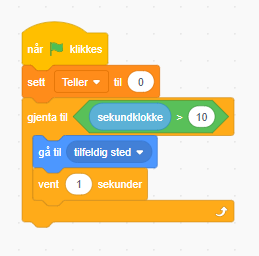

# Begreper

[//]: <> (Slik kan du kommentere!!! hei)

## Program
Et sett med operasjoner som får en datamaskin til å utføre noe

### Beskrivelse
Et program eller en app (applikasjon) er et sett med [operasjoner](#operasjon) som får en datamaskin til å utføre noe. Når dette skjer heter det at programmet *kjøres*. Når en mobiltelefon eller en datamaskin brukes kjøres alltid et eller annet program, for eksempel sms-appen til telefonen, eller Microsoft Word på datamaskinen.

Det å lage et program heter å [programmere](#programmere) eller å kode det og det kjøres ved at programmet lastes inn i [arbeidsminnet](#arbeidsminnet) til mobiltelefonen eller datamaskinen. Det er [posessoren](#prosessor) som utfører operasjonene. Når et program ikke kjøres er det lagrert på [hard disken](#hard-disk).

## Prosessor
Utfører operasjonen til et program når det kjøres

### Beskrivelse
De fleste operasjonene i et program utføres av prosessoren. For at prosessoren skal kunne utføre operasjonene må programmet være lastet inn i [arbeidsminnet](#arbeidsminne).

## Hard disk
Et minne i datamaskinen som lagrer program permanent

### Beskrivelse
Når et program skal kjøres må det være tilgjengelig for datamaskinene. Hard disken er et lagringsmedium som lagrer program permanent, slik at de ikke forsvinner når datamaskinen er slått av.

## Arbeidsminne
Et minne i datamaskinen hvor programmer som kjøres lagres midlertidig

### Beskrivelse
Når et program kjøres lastes det inn i arbeidsminnet til en datamaskin. Jo flere [operasjoner](#operasjon) et program har, desto større plass tar det i arbeidsminnet. Et annet navn på arbeidsminnet er RAM (Random Access Memory).

## Programmere
Å lage et program

### Beskrivelse
Det å lage et [program](#program) er å programmerer eller å kode. Da settes ulike [operasjoner](#operasjon) sammen som får datamaskinen til å utføre noe. Operasjonene kan enten skrives i en tesktfil, [tekstbasert programmering](#tekstbasert-programmering) eller settes sammen grafiskt gjennom blokker, [blokkbasert programmering](#blokkbasert-programmering). Blokkbasert programmering kan være enklere å bruke når programmering læres og tekstbasert programmering brukes gjerne for mer komplekse programmer. Det finnes flere ulike typer [programmeringsspråk](#programmeringsspråk) innen både blokkbasert programmering, og tekstbasert programmering.

## Tekstbasert programmering
Programmering hvor operasjoner skrives i tekstfiler

### Beskrivelse
I tekstbasert programmering består [operasjoner](#operasjon) av instruksjoner satt sammen av ulika ord og tall. Operasjonene utføres linje for linje fra topp til bunn av filen, og hver linje leses fra høyre mot venstre.

Det finnes to ulike typer tekstbasert programmeringsspråk:
1. Tolkede språk: for eksempel [Python](#python) eller [JavaScript](#javascript)
2. Kompilerte språk: [C](#c) eller [C++](#c++)

For tolkede språk kjøres tekstfilen gjennom en [kommandotolk](#kommandotolk) (*interpreter* eng.), da kalles filen ofte for et [skript](#skript), eller kan filen gjøres om til et kjørbart program ved at den [kompileres](#kompilere). Vanligvis lages skript bare når vi bruker tekstbasert programmering, mens alle apper som installeres på en datamaskin er eksempler på kompilerte programmer.

tekstbasert programmering følger faste regler som bestemmes av hvilket [programmeringsspråk](#programmeringspråk) du koder i. Disse reglene kalles for [syntaksen](#syntaks) til programmeringsspråket.

## Skript
En kodefil for tolkede språk innen tekstbasert programmering

### Beskrivelse
Et skript et en fil med kode for tekstbasert programmering for tolkede språk som Python eller JavaScript.

## Kompilere
Lage et kjørbart program av en tekstfil

### Beskrivelse
En eller flere tekstfiler blir kompilert når de blir oversatt til et kjørbart program. Dette programmet trenger da ikke noe annet programmet for å bli kjørt.

## Blokkbasert programmering
Programmering hvor operasjonene settes sammen grafisk gjennom ulike blokker

### Beskrivelse
I blokkbasert programmering består [operasjoner](#operasjon) av blokker som settes sammen grafisk i et eget program. Ofte er det lettere å lære seg å programmere gjennom å bruke blokkbasert programmering, da betydningen til operasjonene kan visualiseres gjennom utseendet til de ulike blokkene.


### Eksempel


## Syntaks
Regler for hvordan operasjoner skrives i tekstbasert programmering

### Beskrivelse
I [tekstbasert programmering](#tekstbasert-programmering) skrives alle operasjoner med bokstaver og tegn. Syntaksen til et slikt språk er regler som bestemmer hvordan operasjonene kan skrives. På samme måte som syntaksen til skriftlig norsk bestemmer hvordan norsk kan skrives, for eksempel en setning starter med stor bokstav og slutter med et punktum, bestemmer syntaksen til tekstbasert programmering hvordan operasjoner kan skrives i en tekstfil. Hvis noe som er skrevet inn i programmet ikke følger reglene for syntaksen for programeringsspråket oppstår er [syntaks-feil](#syntaks-feil). Til syntaksen hører også spesielle [nøkkelord](#nøkkelord) som betyr noe spesielt for det programmeringsspråket.

Syntaksen for å tildele to variabler hver sin verdi og å lage en kommentar er forskjellige for ulike programmeringsspråk. Under vises hvordan det ser ut for Python og JavaScript. Det er flere ting som er likt men også noe som skiller de to språkene.

#### Python-syntaks
```python
# Alder og høyde til en person
alder = 9
høyde = 1.34
```

#### JavaScript-syntaks
```javascript
// Alder og høyde til en person
let alder = 9;
let høyde = 1.34;
```

## Nøkkelord
Et ord som har en spesiell betydning i et programmeringsspråk

### Beskrivelse
De fleste [tekst-programmeringsspråk](#tekstbasert-programmeringsspråk) har nøkkelord (*keyword* eng.) som er reserverte til spesielle [operasjoner](#operasjon). Et nøkkelord kan ikke brukes til [variabelnavn](#variabelnavn) eller [funksjonsnavn](#funksjonsnavn). Ord som brukes til å lage [kontrollstrukturer](#kontrollstruktur) er alle nøkkelord.

#### Eksempel på nøkkelord i Python
* `def`: [definerer](#definere) en [funksjon](#funksjon)
* `if`: starter en [if-setning](#if-setning)
* `else`: lager en else-kodeblokk knyttet til en if-setning
* `True`, `False`: [Boolske](#boolean)-verdier

## Kommandotolk
Et program som kjører et skript.

### Beskrivelse
Tolkede [programmeringsspråk](#tekstbasert-programmering) trenger en kommandotolk for å kunne kjøres. Tekstfilene med programmet kalles da for [skript](#skript). Kommandotolken til et pythonskript heter enkelt og greit `python`. Hvis [Python](#python) er installert og tilgjengelig kan et pythonskript kjøres i en terminal gjennom å bruke kommandotolken `python` foran filnavnet til skriptet.
```bash
> python mitt-program.py
```

## Programmeringsspråk
Et språk som beskriver hvordan operasjoner settes sammen i et program.

### Beskrivelse
Når man [programmerer](#programmere) må man velge et programmeringsspråk man skal bruke for å sette sammen de ulike [operasjonene](#operasjon). Det finnes mange ulike programmeringsspråk som kan brukes til enten [tekstbasert programmering](#tekstbasert-programmering) eller [blokkbasert programmering](#blokkbasert-programmering). De finnes aller flest tekst-programmeringsspråk da disse er enklere å bruke når større program skal lages.

#### Tekstbasert programmeringsspråk

Eksempler på tekst-programmeringsspråk som trenger en kommandotolk
* Python - regne matematikk
* JavaScript - styre nettsider

Eksempler på tekst-programmeringsspråk som må kompileres
* C - programmere kjernen i de fleste operativsystemene
* C++ - programmere dataspill

#### Blokkbasert programmeringsspråk

Eksempler på blokk-programmeringsspråk
* Scratch - programmere enkle spill
* Trinket-block - lære seg å programere
* Blokkuino - brukes til å styre en arduino microship

## Algoritme
En liste med operasjoner som utfører en oppgave.

### Beskrivelse
En algoritme er en liste med [operasjoner](#operasjon) som utfører en oppgave. Oppgaven kan være en matematisk oppgave som å beregne et gjennomsnitt eller å finne typetallet (tallet med høyest frekvens i en tallmengde). Oppgaven kan også være noe hverdagslig som å velge den beste oppskriften i en samling med oppskrifter.

Listen med operasjoner må komme i en gitt rekkefølge, for eksempel er følgende to operasjoner fra en oppskrift:
* blande ingrediensene sammen
* sett inn formen i ovnen
Her er det opplagt at man må blande ingrediensene i en oppskrift før man setter inn formen i ovnen, men for en som starter å lære seg programmering kan det være vanskelig å forstå i hvilken rekkefølge operasjonene i en algoritme skal skrives.

En algoritme kan være noe konkret, som noen linjer med kode som utfør oppgaven eller en abstrakt beskrivelse av hvilke operasjoner som skal utføres og i hvilken rekkefølge de skal gjøres.

[//]: <> (TODO: Gi eksempler eller ta bort)

Mange internettbedrifter bruker algoritmer når de skal presentere varer eller artikler til deg. For eksempel bruker strømmetjenester som Netflix og Spotify slike når de skal presentere filmer eller musikk de mener passer deg. Disse algoritmene baserer seg på at programmene husker hva du har valgt tidligere og hva andre personer som likner deg (samme alder, kjønn, bosted) har valgt.

#### Eksempel: gjennomsnitt
* Lag en list-variabel `tall_liste` hvor du samler alle tall du vil beregne gjennomsnittet på.
* Summer alle tallene i `tall_liste` og lagre resultatet i variabelen `sum`.
* Divider verdien i `sum` med antallet tall i `tall_liste` og lagre verdien i variabelen `gjennomsnitt`

```python
tall_liste = [4, 5, 3, 5, 6, 4, 3, 5]
sum = 0
for tall in tall_liste:
    sum += tall
gjennomsnitt = sum/len(tall_liste)
print(f"Gjennomsnittet til {tall_liste} er {gjennomsnitt:.2f}")
```
```
Gjennomsnittet til [4, 5, 3, 5, 6, 4, 3, 5] er 4.38
```

## Operasjon
En enkelt ting en datamaskin skal gjøre

### Beskrivelse
En operasjon forteller datamaskinen at den skal *gjøre noe*. Et [program](#program) er satt sammen av mange operasjoner etter hverandre. En operasjon er enkelt fortalt, det å *gjøre noe* med en eller flere [verdier](#verdi), å bruke [kontrollstrukturer](#kontrollstruktur) eller å bruke[funksjoner](#funksjon).

Det finnes 4 ulike hovedvarianter av operasjoner som gjør noe med [verdier](#verdi):

1. Bearbeider en verdi (*process* eng.)
2. Lagre en verdi i en variabel
3. Hente inn en verdi (inndata), input
4. Vise en verdi (utdata), output

#### Bearbeide verdier
Når et program bearbeider en eller flere verdier gjøres det noe med verdiene. To ulike måter å bearbeide verdier på er å bruke en [operator](#operatorer) for eksempel `5 + 6` eller å bruke verdiene som [argumenter](#argument) til en [funksjon](#funksjon) for eksempel `gjennomsnitt([3, 6, 8])`.

Flere operasjoner som bearbeider verdier kan settes sammen til [uttrykk](#uttrykk) for eksempel:
```python
import math
5+3*math.sqrt(3)/2
```
Merk at uttrykket over blir `7.598076211353316` men det lagres ikke noe steder.

#### Lagre verdi
Verdier lagres i [arbeidsminnet](#arbeidsminne) som [variabler](#variabel) og kan deretter brukes senere i programmet.

Når en verdi lagres i en variabel brukes en [tilordningsoperator](#tilordningsoperatorer) (`=`).

```python
alder = 9
navn = "Marie"
```
Her lagres to ulike verdier: `9` og `"Marie"`, til variablene: `alder` og `navn`.

#### Hente en verdi, input
En datamaskin hadde vært ganske verdiløs hvis den ikke kunne hente verdier enten fra en bruker eller fra et annet sted, for eksempel en avstandssensor på en bil.

```python
navn = input("Hva heter du?")
```
Her brukes funksjonen `input` til å spør brukeren om å skrive inn sitt navn. Programmet stopper opp og venter på at brukeren skal skrive inn sitt navn.

#### Vise en verdi, output
En verdi kan vises til en bruker for eksempel ved at den vises på skjermen, eller skrives til en fil.

```python
print("Jeg er 13 år!")
```
```
Jeg er 13 år!
```

Her sendes streng-verdien `"Jeg er 13 år!"` som argument til [funksjonen](#funksjon) `print`, som så viser den på skjermen.

## Kontrollstruktur
Bestemmer hvilke deler av et program som skal utføres.

### Beskrivelse
Operasjoner i et program utføres fra toppen av tekstfilen og nedover. Hver linje i tekstfilen utføres en gang. Kontrollstrukturer kan bestemme at noen linjer skal utføres og andre ikke, eller at noen linjer skal utføres mange ganger. Slik bestemmer kontrollstrukturer flyten i et program, og de består blandt annet av [if-setninger](#if-setning) og [løkker](#l%c3%b8kke).

Under vises en kodesnutt med de to kontrollstrukturene [for-løkke](#for-løkke) og [if-setning](#if-setning).

```python
for tall in range(6):
    if tall % 2 == 0:
        print(f"Tallet: {tall} er et partall")
    else:
        print(f"Tallet: {tall} er et oddetall")
```
```
Tallet: 0 er et partall
Tallet: 1 er et oddetall
Tallet: 2 er et partall
Tallet: 3 er et oddetall
Tallet: 4 er et partall
Tallet: 5 er et oddetall
```

## Uttrykk
En eller flere operasjoner som er satt sammen og som returnerer en verdi.

### Beskrivelse
Et uttrykk (*expression* eng.) består av en eller flere [operasjoner](#operasjon) som er satt sammen. Et uttrykk resulterer alltid i en verdi.

```python
navn = "Petter"
resultat = 5*5 + 4*4 + 3*3 + 2*2 + 1
```

Her er to linjer som begge [tilordner](#tilordne) to variabler verdier. Verdiene er begge resultater av to uttrykk. Den første linjen består av et uttrykk som resulterer i verdien: `"Petter"`. Den andre linjen består av et uttrykk som resulterer i tall-verdien `55`.

## Variabel
Er et navngitt sted i arbeidsminnet som lagrer verdier.

### Beskrivelse
En variabel er et navngitt sted i arbeidsminnet som lagrer en eller flere [verdier](#verdi) i et program. Navnet til variabelen kan så brukes i f eks [uttrykk](#uttrykk) for å representere verdien til variabelen.

En bestemmer selv hva navnet til en variabel skal være, men [syntaksen](#syntaks) til programmeringsspråket legger begrensninger til hva et [variabelnavn](#variabelnavn) kan være. Før man kan bruke en variablel må den [definerers](#definere). Navnet til en variabel brukes når du:

1. [definerer](#definerer) variablen
2. bruker verdien til variablen
3. endrer verdien til variablen.

De tre måtene å bruke en variabel på illustreres med følgende eksempel:
```python
lån = 500000.
rente_prosent = 0.05
rente = lån*rente_prosent
lån = lån + rente
```
Her [defineres](#definere) først tre variabler: `lån`, `rente_prosent` og `rente`. På tredje rad brukes variabelen `lån` og `rente_prosent` i et [uttrykk](#uttrykk) for å regne ut hva renten skal være. På siste rad endres verdien til variabelen `lån` ved at renten legges til den første verdien til lånet.

#### Variabel i matematikken
Ordet variabel brukes også i algebraen i matematikken. Da betegner det ofte en ukjent tallverdi, for eksempel *x, y*. Innen programmering har en variabel *alltid* en verdi og representerer altså ikke noe ukjent.

## Variabelnavn
Navnet til en variabel.

### Beskrivelse
En [variabel](#variabel) har altid et navn. [Syntaksen](#syntaks) til et programmeringsspråk legger noen krav til navnet.

For Python gjelder disse kravene til et variabelnavn

1. kan inneholde bokstaver, siffer og understrek.
2. kan IKKE inneholde mellomrom ` `, bindestrek `-` eller punktum `.`: Bruk heller `_` mellom ord i variabelnavnet.
3. kan IKKE starte med et siffer.
4. må være unikt. Flere variabler kan altså ikke ha samme navn.
5. kan ikke være noen av de [reserverte ordene](#reserverte-ord) i Python, for eksempel: `if`, `for`, `import`, `else`, `elif`.

### Tips til variabelnavn
Bruk variabelnavn som beskriver hva verdien til variabelen skal brukes til. For eksempel er navn som `a`, `b` oftest dårlige navn, mens `lån`, `navn` eller `poengsum` er bra navn.

## Verdi
En konkret representasjon av data.

### Beskrivelse
En verdi representerer en størrelse som kan manipuleres av et program. Verdier er ofte det man til daglig kaller data. En datamaskin er altså en maskin som bruker verdier! Verdier har ulike [datatyper](#datatype) som beskriver hva verdien kan brukes til:

#### Eksempler på datatyper:
* [tall](#tall): `2, -5, 0.45, 1e-3`
* tekst eller [strenger](#streng): `"A", "Jeg heter Lise."`
* [boolean](#boolean): `True, False`
* [liste](#liste): `[5, 3, 8], ["ost", 2, "melk", 5]`

## Datatype
Beskriver hva en verdi kan brukes til

### Beskrivelse
Alle verdier har en datatype som beskriver hva den kan brukes til. De vanligste datatypene er:
* [tall](#tall): Brukes i all matematikk, se for eksempel [aritmetiske operatorer](#aritmetiske-operatorer).
* [strenger](#streng): Brukes til å representere tekst-verdier.
* [boolean](#boolean): Brukes til å beskrive om noe er *sant* (`True`) eller *falskt* (`False`).
* [lister](#liste): Brukes å samle verdier i en ordnet rekkefølge.
* [assosiative lister](#assosiativ-liste). Brukes til å samle verdier som er assosiert med en [nøkkel](#nøkkel).

En [verdi](#verdi) kan konverteres mellom ulike datatyper

## Konvertere datatype
Forandre datatypen til en verdi

### Beskrivelse
En [verdi](#verdi) har alltid en [datatype](#datatype). Verdiene: `5` og `"5"` har datatypene [heltall](#heltall) og [streng](#streng). Verdier kan i flere tilfeller konverteres mellom ulike datatyper. Følgende funksjoner konverterer en verdi til sin datatype:
* [heltall](#heltall) : `int(verdi)`
* [flyttall](#flyttall) : `float(verdi)`
* [streng](#streng) : `str(verdi)`
* [boolean](#boolean) : `bool(verdi)`
* [lister](#liste) : `list(verdi)`

#### Konvertering kan endre på verdien
Tabellen viser hvordan verdier blir konvertert mellom ulike datatyper. I noen tilfeller endres verdien etter konverteringen.
| Funksjon   | Eksempel     | Returnerer  |
|:-----------|:-------------|:------------|
|`int`       |`int("5")`<br>`int(4.67)`   |Heltallet `5`<br>Heltallet `4`, alle desimalene fjernes uten avrundning.|
|`float`     |`float("6.7")`<br>`float(5)`|Flyttallet `6.7`<br>Flyttallet `5.0`      |
|`str`       |`str(5)`<br>`str(4.8)`      |Strengen `"5"` <br> Strengen `"4.8"`  |

#### Ikke alle verdier kan konverteres
Prøver man å konvertere en bokstav til en tallverdi får man en feilmelding.
```python
int("fem")
```
```
ValueError: invalid literal for int() with base 10: 'fem'
```

## Definere
Operasjon som lager en variabel eller funksjon.

### Beskrivelse
For å kunne bruke en [variabel](#variabel) eller [funksjon](#funksjon) må de først defineres. Når en variabel blir definert må den også bli [tilordnet](#tilordne) en verdi. I noen [programmeringsspråk](#programmeringsspråk) kan man si ifra at man skal bruke en variabel uten å gi den en verdi. Da heter det å *deklarere* en variabel. Når en variabel defineres knyttes et [variabelnavn](#variabelnavn) til en verdi som lagres i [arbeidsminnet](#arbeidsminne). Når en funksjon defineres knyttes et [funksjonsnavn](#funksjonsnavn) til et sett med operasjoner. Navnet brukes så i programmet for å representere enten verdien til variabelen eller alle operasjonen til funksjonen.

I koden under blir variabelen `hilsen` og funksjonen `si_hilsen` definer. Variabelen blir brukt inne i funksjonen og funksjonen blir kallt etter den er blitt definert.

```python
hilsen = "Hei verden!"

def si_hilsen():
    print(hilsen)

si_hilsen()
```
```
Hei verden!
```
Hvis en variabel eller funksjon blir brukt før den er definert får man et [programmeringsfeil](#programmere).

```python
def si_hilsen():
    print(hilsen)

si_hilsen()
hilsen = "Hei verden!"
```
```
NameError: name 'hilsen' is not defined
```

## Tilordne
Gir eller endrer en verdi til en variabel.

### Beskrivelse
Når en verdi lagres i en variabel heter det at denne variabelen tilordnes en verdi. Dette gjøres med en [tilordningsoperator](#tilordningsoperator), som i Python er `=`. På venstre side av tilordningsoperatoren må [variabelens navn](#variabelnavn) stå og på høyre side må det stå en verdi eller et uttrykk som resulterer i en verdi. Denne verdien blir så lagret i variabelen.

I kodesnutten under blir to variabeler, `navn` og `resultat`, tilordnet streng-verdien: `"Petter"` og resultatet til det aritmetiske uttrykket: `5*5 + 4*4 + 3*3 + 2*2 + 1` som blir `55`.

```python
navn = "Petter"
resultat = 5*5 + 4*4 + 3*3 + 2*2 + 1
print(navn, resultat)
```
```
Petter 55
```

## Tall
Datatype som brukes til verdier som representerer tall.

### Beskrivelse
[Verdier](#verdi) av [datatypen](#datatype) tall brukes i programmering til å utføre operasjoner som vi i hverdagen tenker på som matematiske operasjoner. Når to tall-verdier skal legges sammen gjennom addisjon må disse verdiene for eksempel være tall-verdier.

En del programmeringsspråk for eksempel [Python](#python) skiller på datatypen [heltall](#heltall) og [flyttall](#flyttall). Flyttal brukes til å reprsentere tall med desimaler. Andre programmeringsspråk, som for eksempel [JavaScript](#javascript]) eller [Scratch](#scratch), skiller i utgangspunktet ikke på heltall eller flyttal.

I kodesnutten under vises eksempler på de to tall-datatypene i Python.
```python
heltall1 = 2
flyttal1 = 3.
heltall2 = heltall1*10
flyttal2 = heltall1 + flyttal1
print(f"Heltall: {heltall1}, {heltall2} og flyttal: {flyttal1}, {flyttal2}")
```
```
Heltall: 2, 20 og flyttal: 3.0, 5.0
```
Datatypen til resultatet fra en [aritmetisk operator](#aritmetiske-operatorer), hvor begge verdiene er [heltall](#heltall), er et heltall. Er en av verdiene et [flyttall](#flyttall) blir datatypene til  resultatet et flyttal.

## Heltall
Datatype som brukes til å representere heltall

### Beskrivelse
Heltall er tall som ikke har desimaler. Heltall brukes for eksempel til å representere et antall eller en posisjon i en rekkefølge. Heltall er mer naturlig for en datamaskin å arbeide med enn flyttal. Det er fordi datamaskinens bruker [binære tall](#bin%c3%a6re-tall), som er sattsammen av sifrene 1 0g 0, til å representere all data, og heltall kan enkelt representeres med binæretall.

I programmeringsspråket [Python](#python) heter datatypen for helttall `int`, som er kort for integer og er engelsk for heltall. Funksjonen `int` kan brukes til å lage et heltall fra for eksempel en [streng](#streng).
```python
tall_streng = input("Skriv inn ett heltall som skal kvadreres: ")
tall_int = int(tall_streng)
print(f"Du skrev inn: {tall_streng}: {tall_streng}^2 = {tall_int**2}")
```
```
Skriv inn ett heltall som skal kvadreres: 4
Du skrev inn: 4: 4^2 = 16
```

I eksemplet over hentes en streng inn fra brukeren og så [konverteres](#konvertere-datatype) den til et heltall med `int` funksjonen. Hvis brukeren skriver en streng som *ikke* går ann å gjøre om til et heltall sier kommandotolken ifra ved å reise en [programmeringsfeil](#programmeringsfeil).
```
Skriv inn ett heltall som skal kvadreres: fire
ValueError: invalid literal for int() with base 10: 'fire'
```

## Flyttall
Datatype som brukes til å representere desimaltall

### Beskrivelse
Et flyttal er et desimaltall. I programmering bruker man `"."` (punktum) istedefor `","` (komma) for å angi desimalen i et flyttal (desimaltall). Ordet *flyt* (engelske *float*) kommer fra at plasseringen av desimaltegnen *flyter*. Litt forenklet kan `0.03` representers med heltallet 3 hvor desimaltegnet er flyttet 2 plasser.

#### Flyttal er unøyaktig representert
Et flyttal representeres ikke eksakt i arbeidsminnet. For eksempel består desimaltallet $\sqrt{2}$ av uendelig mange desimaler og må i en datamaskin representeres på en avrundet og unøyaktig måte. I Python er $\sqrt{2}\simeq 1.4142135623730951$. Dette kan illustreres med følgende kodesnutt:
```python
import math
print(math.sqrt(2))
```
```
1.4142135623730951
```

Det er ikke bare desimaltall med ubegrensede desimaler som representeres unøyaktig i Python. Følgende kodesnutt illustrerer dette.
```python
print(3*0.1)
```
```
0.30000000000000004
```
`0.30000000000000004` er nesten `0.3` men det *er* ikke eksakt `0.3` slik det borde være.

#### Avrunde flyttall
Et flyttall kan avrundes med funksjonen `round`. Flyttallet som skal avrundes overføres som argument til `round`.
```python
print(10/3)
print(round(10/3))
print(round(10/3, 2))
```
```
3.3333333333333335
3
3.33
```
Her vises først en unøyaktig representasjon av 10/3, så heltalls delen 3, hvor `round` er brukt uten ekstra [argumenter](#argument), og sist en versjon som er avrundet til to desimaler, hvor antallet desimaler, 2, er sendt med som et andre [argument](#argument) til `round`.

#### Eksponensiell notasjon av flyttall
For å enklere representere store og små flytttall i pythonbrukes eksponensiell notasjon. Denne notasjonen bruker det at et hvilket som helst tall kan deles opp i et desimaltall som ganges med 10 opphøyd i et heltall (vitenskapelig notasjon). For eksempel kan et stort tall $567000000$ skrives som $5,67\cdot 10^{9}$ og et litet tall $0,0006$ kan skrives som $6\cdot 10^{-4}$. I Python skrives disse to tallene med eksponensiell notasjon:
```python
print(5.67e9)
print(6e-4)
```
```
5670000000.0
0.0006
```
Her byttes potensdelen ($\cdot 10^9$ og $\cdot 10^{-5}$) i den vitenskapelige notasjonen ut med `e9` og `e-5`.

## Programmeringsfeil
En feil som oppstår når et program kjøres

### Beskrivelse
Det er vanlig å skrive program med feil (*bug* eng.) i seg. Den eneste måten å lære seg å bli en god progammerere på er å gjøre mange feil. For å lære seg mer av feilene er det viktig å kunne [feilsøke](#feils%c3%b8ke) (*debug* eng.) og å kjenne til hvilken type feil det er som har oppstått.

Det finnes ulike typer programmeringsfeil og her deler vi inn i tre ulike typer:
1. [Syntaks-feil](#syntaks-feil): (*syntax error* eng.) Når kode bryter mot syntaksen til et [tekstbasert programmeringsspråk](#tekstbasert-programmeringsspråk).
2. [Kjøretids-feil](#kjøretids-feil): (*runtime error* eng.) Når en feil oppstår mens et program kjører og som gjør at det avbrytes.
3. [Logisk feil](#logisk-feil): (*logic error* eng.) Når et program gjør noe som ikke var ment fra den som programmerte det men programmet avbrytes ikke.

#### Syntaks-feil
En syntaks-feil er en feil som oppstår når en bruker skriver noe som ikke er lov i henhold til [syntaksreglene](#syntaks). Program med syntaks-feil vil ikke kunne kjøres og man får som oftest informasjon om hvor i programmmet synktaksfeilen er. Her følger noen syntaks-feil fra Python med påfølgende feilmelding og forklaring.

##### Mangler en parentese
```python
print("Hei verden!"
tall = 12
```
```
tall = 12
   ^
SyntaxError: invalid syntax
```
Meldingen er litt missvisende da feilen faktisk skjer på linjen over. Men Python-[kommandotolken](#kommandotolk) prøver å avslutte linjen med `print` gjennom å gå til neste linje.

##### Mangler et kolon `:` på slutten av en `if`-setningen.
```python
if tall > 10
    print("Tallet er større enn 10!")
```
```
if tall > 10
           ^
SyntaxError: invalid syntax
```

##### Feilstave [nøkkkelordet](#nøkkelord) `else`.

```python
if poeng > 36:
    print("Du klarte poenggrensen!")
esle:
    print("Du klarte ikke poenggrensen!")
```
```
esle:
    ^
SyntaxError: invalid syntax
```
##### Utelate [nøkkelordet](#nøkkelord) `def`.
```python
addere(a, b):
    return a+b
```
```
addere(a, b):
            ^
SyntaxError: invalid syntax
```

#### Kjøretids-feil
Et kjøretids-feil oppstår når en feil fører til at programmet avbrytes. Det er altså feil som har korrekt syntakst men som ikke gir mening å utføre.

##### Bruker en [variabel](#variabel) som ikke er [definert](#definere).
```python
navn = "Svein"
print(f"Ditt navn er: {etternavn}")
```
```
print(f"Ditt navn er: {etternavn}")
NameError: name 'etternavn' is not defined
```

##### Bruker en [operator](#operatorer) på feil [datatyper](#datatype).
```python
brus = 34.50
antall = input("Hvor mange brus vil du ha:")
print(f"Du bruker {brus*antall} kr på brus.")
```
```
print(f"Du bruker {brus*antall} kr på brus.")
TypeError: can't multiply sequence by non-int of type 'float'
```

##### Bruker en [indeks](#indeks---liste) til et [element](#element---liste) som ikke finnes i en [liste](#liste).
```python
poeng_liste = [34, 54, 23, 26, 45]
poeng = poeng_liste[5]
```
```
poeng = poeng_liste[5]
IndexError: list index out of range
```
##### Deler et tall med verdien 0
```python
antall = 0
total_pris = 145
print(f"Dere er {antall} personer som hver skal betale: {total_pris/antall} hver.")
```
```
print(f"Dere er {antall} personer som hver skal betale: {total_pris/antall} hver.")
ZeroDivisionError: division by zero
```
#### Logisk feil
Et logisk feil oppstår når et program gjør noe som ikke var ment fra den som programmerte det. Logiske feil er ofteste de vanskeligste å finne ettersom programmet ikke avbrytes, som ved [syntaks-feil](#syntaks-feil), men det generer oftest ikke et forventet resultat. Her følger noen logiske feil fra Python med påfølgende forklaring.

##### Bruke feil variabelnavn.
```python
alder = 45
høyde = 177
if høyde >=18:
    print("Du er myndig!")
```

##### Bruker feil innrykk på en kodeblokk.
```python
sum = 0
liste = [1, 5, 7, 2, 9]
størst = liste[0]
for tall in liste:
    sum += tall
if tall > størst:
    størst = tall
```

##### Bruker sammenligningsoperatorer feil.
```python
alder = 16
if alder <= 18:
    print("Du er myndig!")
```

##### Bruker komma istedenfor punktum for flyttall.
```python
høyde = 1,77
print(f"Din høyde er: {høyde}.")
```

## Feilsøke
Finne programmeringsfeil i et program

### Beskrivelse
Å feilsøke (*debug* eng.) et program er å prøve å finne et programmeringsfeil. Dette kan ofte være frustrerende og tidkrevende, men da kan det være godt å vite at alle gjøre feil. Det viktigste er at man lærer seg av feilene.

Når en feil oppstår må man først finne ut hvilken type programmeringsfeil det er.
1. [syntaks-feil](#syntaks-feil)
2. [kjøretids-feil](#kjøretids-feil)
3. [logisk feil](#logisk-feil)

Er det en syntaks-feil eller en kjøretids-feil sier  kommandotolken ifra hvor feilen oppstod. Da kan man gå til den linjen i koden og prøve å rette på den.

Er det en logisk feil er det oftest vanskeligere. Da kan man legge inn `print` kommandoer i koden for å "se" hva verdien til en variabel er underveis i programmet.

## Binære tall
Tall som representeres med sifferene 1 og 0

### Beskrivelse
Binære tall er tall som representerers med sifferene 1 og 0 for eksempel 1011 er et binært tall. Plassverdien til binære tall baserer seg på grunntallet 2 og ikke 10 som det er for ti-tall systemt. For å regne ut verdien til tallet ganger vi sifferverdien med plassverdien, akkurat som vi gjør med *vanlige tall* fra titall systemet. Plassverdien til de 4 første posisjonene i et binært tall er: 8, 4, 2, 1. Verdien til 1011 kan vi derfor regne ut til å være: $1\cdot8 + 0\cdot4 + 1\cdot 2 + 1\cdot 1 = 11$. Inne i en datamaskin lagres **allt** som binæretall. Dette er fordi en datamaskin består av veldig mange strømbrytere som enten kan være av (0) eller på (1).
TODO: Skal vi skrive mer om dette temaet eller vise til annen kilde!

## Streng
Datatype som brukes til å representere tekst-verdier

### Beskrivelse
Innen programmering kalles en tekst for en streng (*string* eng.). Ordet kommer fra at man lagrer en *streng* med enkeltbokstaver. Mange ganger kan det være nyttig å tenke på en streng som en [liste](#liste) med enkelt bokstaver (*characters* eng.) men til forskjell fra lister kan ikke enkeltelementene endres uten å lage en ny streng.

#### Streng-operatorer
Strenger kan legges sammen med [streng-operatoren](#streng-operatorer) `+`. Denne operasjonen kalles da å konkatenere to strenger, men oftest sier man bare å *legge sammen* to strenger.

```python
fornavn = "Elise"
etternavn = "Sandberg"
print("Eleven heter " + fornavn + " " + etternavn + ".")
```
```
Eleven heter Elise Sandberg.
```
Det finnes flere ulike [operasjoner](#operasjon) som kan gjøres på og med strenger...
TODO: Legge til noe flere operasjoner.

TODO: Skriv ferdig!!
## Formatere streng
Gjøre


## Boolean
Datatype som brukes til å representere sanne og falske verdier

### Beskrivelse
Verdier av datatypen boolean kalles boolske verdier og de brukes til å representere sanne og falske verdier. Man bruker boolske verdier til å svare på [betingelser](#betingelse) eller til å representere svar på *ja- og nei-spørsmål*. Boolske verdier er også resultatet av [logiske operatorer](#logiske-operatorer).

#### Eksempel på boolske verdier i Python
```python
er_høy = True
liker_fisk = False
if er_høy:
    print("Du er et høyt menneske!")

if liker_fisk:
    print("Du liker fisk!")
```
```
Du er et høyt menneske!
```
## Liste
En samling av verdier som er ordnet i en rekkefølge

### Beskrivelse
En liste (*array* eng.) brukes når du har mange verdier som hører sammen. Verdiene i en liste kalles [elementer](#element---liste) og er ordnet i en rekkefølge. Verdien til hvert element hentes ut fra listen gjennom å bruke nummeret i rekkefølgen elementet har i listen. Dette nummeret kalles for [indeksen](#indeks) til elementet. Du kan lagre listen i en [variabel](#variabel) slik at du kan bruke verdiene seinere i et program.

```python
deltagere = ["Rebecca", "Erik", "Selma", "Amanda"]
deltager = deltagere[2]
deltagere[1] = "Svein"
antall_deltagere = len(deltagere)
```
`deltagere` er en list-variabel med fire elementer. Hvert element representerer navnene til deltagerne i en konkuranse. `deltager` er en variabel som har det *tredje* (ikke det andre!) elementet fra listen. Til slutt endres verdien til det andre elementet til `"Svein"`. Deltager `"Erik"` er altså byttet ut med `"Svein"`.

#### Element - liste
Verdiene i en liste kalles for elementer.
```python
# To lister med streng og heltalls elementer.
deltagere = ["Rebecca", "Erik", "Selma", "Amanda"]
poeng = [34, 23, 39, 41]
print(deltagere[2], poeng[2])
```
```
Selma 39
```
Elementene i de to listene over er [streng-verdiene](#streng): `"Rebecca"`, `"Erik"`, `"Selma"`, `"Amanda"` og [heltallene](#heltall): `34`, `23`, `39`, `41`.

En liste kan ha elementer med ulike datatyper.
```python
# Ulike datatyper som elementer i en Liste
deltagere = ["Rebecca", 34, "Erik", 23, "Selma", 39, "Amanda", 41]
print(deltagere[2], deltagere[3])
```
```
Erik 23
```
En liste kan også ha andre lister som sine elementer og det kalles en [nested liste](#nested-liste).
```python
# Lister som elementer i en liste
deltagere = [["Rebecca", 34],
             ["Erik", 23],
             ["Selma", 39],
             ["Amanda", 41]]
print(deltagere[3][0], deltagere[3][1])
```
```
Amanda 41
```

#### Indeks - liste
En indeks brukes når man skal hente ut eller endre på elementene i en liste. Indeksen betegner plasseringen til verdien i listen og må alltid angis med et [heltall](#heltall) (flyttal virker ikke, da plassering 2.59 ikke gir mening).
Det første elementet har indeksen `0`, det andre har indeksen `1` og så videre. På rad to over brukes indeksen `2` til å hente ut verdien til det tredje elementet i listen `deltager`. På rad tre over brukes indeksen `1` til å endre det andre elementet i listen til verdien `"Svein"`. Merk at indeksen må stå innenfor [indeksoperatoren](#indeksoperator) som er de to `[]`-parentesene.

#### Indeksoperator
Operator `[]`, som brukes etter en liste for å få tilgang til et element i listen. For eksempel: `liste[2]`, hvor indeksoperatoren brukes til å hente ut det tredje elementet fra listen.

#### Lengden til en liste
Funksjonen `len(liste)` returnerer lengden til en liste hvilket er det samme som antallet element i en liste.

#### Slice - liste
I Python kan en slice brukes til å hente ut flere verdier fra en liste. Syntaksten likner litt på den til range, fra [for-løkker](#for-løkke). Den bruker tre verdier:
1. start-indeksen til slicen.
2. slutt-indeksen (opp til men ikke inkludert) til slicen.
3. avstandet mellom hvert element som er i slicen.

```python
handleliste = ["Smoothie", "Nøttemix", "Mellombar", "Yogurt", "Melk"]
tørrvarer = handleliste[1:3:1]
print(f"Tørrvarer i handlelisten: {tørrvarer}.")
```
```
Tørrvarer i handlelisten: ['Nøttemix', 'Mellombar'].
```
Variablen `tørrvarer` er her lagd med en slice av listen `handleliste`. Den starter på andre elementet (indeks 1) og går opp til (men ikke inklusive) det fjerde elementet (indeks 3) og avstandet mellom elementene er 1.

Det er mange finurlige måter å lage slicer på som vises i eksemplet under.
```python
handleliste = ["Smoothie", "Nøttemix", "Mellombar", "Yogurt", "Melk"]
print("Hele listen:", handleliste)

# Hvis første tallet i slicen utelukkes, betyr det at den returnerte
# listen starter fra starten.
print("Fra start:  ", handleliste[:3:1])

# Hvis andre tallet i slicen utelukkes, betyr det at den returnerte
# listen slutter med siste element
print("Til slutt:  ", handleliste[3::1])

# Hvis siste tallet i slicen utelukkes, tolkes det slik at hver element
# mellom start og slutt er med.
print("Samme liste:", handleliste[:2:1], "=", handleliste[:2:])
print("Også samme: ", handleliste[3::1], "=", handleliste[3::])

# Hvis første og andre tallet (start og slutt) i slicen utelukkes, tolkes
# det slik at hele listen inkluderes (fra første til siste element).
print("Annenhver:  ", handleliste[::2])

# Hvis siste tall er negativt går listen baklangs
print("Omvendt:    ", handleliste[::-1])
```
```
Hele listen: ['Smoothie', 'Nøttemix', 'Mellombar', 'Yogurt', 'Melk']
Fra start:   ['Smoothie', 'Nøttemix', 'Mellombar']
Til slutt:   ['Yogurt', 'Melk']
Samme liste: ['Smoothie', 'Nøttemix'] = ['Smoothie', 'Nøttemix']
Også samme:  ['Yogurt', 'Melk'] = ['Yogurt', 'Melk']
Annenhver:   ['Smoothie', 'Mellombar', 'Melk']
Omvendt:     ['Melk', 'Yogurt', 'Mellombar', 'Nøttemix', 'Smoothie']
```

#### Nested liste
En nested liste er en liste som har lister som sine element.
```python
deltagere = [["Rebecca", 34],
             ["Erik", 23],
             ["Selma", 39],
             ["Amanda", 41]]
print(f"{deltagere[2][0]} er {deltagere[2][1]} år.")
```
```
Selma er 39 år.
```
Her er listen `["Selma", 39]` tredje elementet i listen `deltagere`. For å få tak på et element inne i denne innerste listen brukes [inkeksoperatoren](#indeksoperator) to ganger:


## Assosiativ liste
En samling verdier som hver er assosiert med en nøkkel

### Beskrivelse
En assosiativ liste (*maps*, *dictionaries* eng.) brukes når du har mange verdier som hører sammen og hvor hver verdi knyttes til en (nøkkel). For eksempel kan man lagre verdier knyttet til en elev i en assosiativ liste hvor nøklene kan være `fornavn`, `etternavn`, `klasse` og `resultater`. Et element i en assosiativ liste er altså et nøkkel - verdi par hvor nøkkelen altid er en [streng](#streng) og verdien kan ha en vilkårlig [datatype](#datatype).

Assosiative lister finnes i de fleste programmeringsspråk men heter da gjerne noe annet.
* python: `dict` - kort for *dictionary*
* JavaScript: `Object`
* Scratch: Det finnes ikke assosiative lister i Scratch (enn?!)

```python
elev = {
    "fornavn": "Salma",
    "etternavn": "Eriksen",
    "klasse": "8A",
    "resultater": [4, 5, 3, 6, 5, 4]
}

# Hente ut element-verdier
fornavn = elev["fornavn"]
resultater = elev["resultater"]

# Endre element-verdier
elev["klasse"] = "9A"
```

#### Element - assositativ liste
Et element i en assositativ liste er en nøkkel - verdi par. Nøkkelen sier noe om hva verdien er (tenk [variabelnavn](#variabelnavn)) og verdien er en [verdi](#verdi) som er akseptert i programmeringsspråket. I eksemplet er verdiene til elementene, 3 [strenger](#streng) og en [liste](#liste).

## Operatorer
Enkelt tegn som bearbeider en eller flere verdier og returnerer en verdi

### Beskrivelse
En operator er et enkelt tegn som brukes til å bearbeide en eller to [verdier](#verdi). Operatorer er ofte en kilde til misforståelser når man skal lære seg programmering fordi de likner tegn som brukes i hverdagsspråk og matematikk, og i tillegg kan de ulike operatorene likne hverandre.

Likt for alle operatorer er at de bearbeider (opererer på) en eller flere verdier og de returnerer *alltid* en verdi. Addisjons-operatoren `+` opererer på to tall og returnerer resultatet av addisjonen. For eksempel `3 + 4` adderer verdiene `3` og `4` og returnerer `7`. Addisjons-operatoren er en [aritmetisk operator](#aritmetisk-operator).

Det finnes flere ulike typer operatorer. Disse skilles ved at de bearbeider og returnerer ulike typer verdier:

* [aritmetiske operatorer](#aritmetisk-operatorer): bearbeider og returnerer [tall-verdier](#tall).
* [strengoperatorer](#strengoperatorer): bearbeider [streng](#streng) og [tall](#tall)-verdier og returnerer nesten alltid streng-verdier.
* [logiske operatorer](#logiske-operatorer): bearbeider og returnerer [boolske-verdier](#boolean).
* [sammenligningsoperatorer](#sammenlignings-operator): bearbeider ulike typer verdier men returnerer alltid en [boolsk-verdi](#boolean).
* [tilordningsoperatorer](#tilordningsoperatorer): tilordner en variabel som er på venstre side av operatoren en verdi.

### Operator-rekkefølge
Operatorer kan brukes til å sette sammen [uttrykk](#uttrykk): `7-2*3+2`. For at slike sammensatte uttrykk skal evalueres entydig finnes det regler for i hvilken rekkefølge operatorene skal utføres i (*operator precedence* eng.). I uttrykket `4-2*3+2` brukes de tre aritmetiske operatorene `-`, `+` og `*` og de utføres i samme rekkefølge som man gjør i matematikken. Hvert programmeringsspråk har egne regler for hvilke rekkefølge operatorer utføres i. Disse bør en avansert programmererer kjenne til. Rekkefølgen for de aritmetiske operatorene er de samme for de aller fleste programmeringsspråk:
1. parentser
2. potenser
3. multiplikasjon og divisjon
4. addisjon og subtraksjon
Når to operatorer som har samme rekkefølge kommer etter heverandre i et uttrykk utføres operatorene fra venstre til høyre.
`7-2*3+2` som:
1.`7-`**`2*3`**`+2`: Utfører ganger-operatoren
2.**`7-6`**`+2`
3.`1+2`
4.`3`
Merk at hvis ikke operatorene utføres fra venstre til høyre ville for eksempel rad 2 bli noe annet: `7-`**`6+2`** $\rightarrow$ `7-8` som blir `-1`.

### Unære og binære operatorer
En operator som bearbeider to verdier kalles en binær operator og en operator som bearbeider en verdi kalles en unær operator. `+` er et eksempel på en binær aritmetisk operator da den brukes til å legge sammen to verdier. `-` er et eksempel på en aritmetisk operator som både kan være unær og binær. `-` er unær når den representerer et negativt fortegn: `-5`, og binær når den representerer substraksjon: `7-4`.

### Vanlige misforståelser ved bruk av operatorer.
* Tilordningsoperator må stå til venstre for et uttrykk. Man kan altså ikke skrive `4*6=x`
* Tilordningsoperatoren blandes ofte sammen med likhets operatoren
* `4a` betyr ikke `4*a`. Mener du variabelen `a` ganger 4 skriver du det eksplisit ved å bruker multiplikasjons-operatoren `*`.

## Aritmetiske operatorer
Tegn som bearbeider en eller to tall-verdier

### Beskrivelse
Inne programmering representeres de fire regneartene ved aritmetiske operatorer, som er tegn som bearbeider [tall-verdier](#tall) og returnerer en annen tall-verdi.

#### Fire regneartene
* `+`: addisjon; `5+2` resulterer i `7`
* `-`: subtraksjon ([binært](#un%c3%a6re-og-bin%c3%a6re-operatorer)) og minus fortegn ([unært](#un%c3%a6re-og-bin%c3%a6re-operatorer)); `5-2` resulterer i `3`.
* `*`: multiplikasjon; `5*2` resulterer i `10`.
* `/`: divisjon; `5/2` resulterer i `2.5`

#### Potens, heltallsdivisjon og modulus
* `**`: potens; `5**2` resulterer i `25`.
* `//`: heltallsdivisjon; `5//2` resulterer i `2`.
* `%`: modulus; rest ved heltallsdivisjon, `5%2` resulterer i `1`.

#### Absoluttverdien til et tall
Absoluttverdien til et tall gir oss avstanden mellom tallet og 0 på en tallinje og kan sees på som en aritmetisk operator. I Python returnerer funksjonen `abs` absoluttverdien til ett tall. En avstand er alltid positiv slik at:
```python
print(abs(3))
print(abs(-3))
```
viser begge utskriften `3`. Absoluttverdien til et tall brukes ikke så ofte i matematikken men er vanlig å bruke innen programmering når [flyttall skal sammenlignes](#sammenligne-flyttal).

## Strengoperatorer
Tegn eller funksjoner som bearbeider streng-verdier og returnerer en streng

### Beskrivelse
Strengoperatorer brukes til å bearbeide [strenger](#streng) og da det er en operator returnerer den alltid en annen streng.

## Logiske operatorer
Tegn eller ord som bearbeider en eller to boolske-verdier og returnerer en boolsk verdi

### Beskrivelse
Den enkleste måten å bearbeide en eller to verdier er å bruke en operator.

## Sammenligningsoperator
Tegn som sammenligner to verdier og returnerer en boolsk verdi

### Beskrivelse
En sammenligningsoperator sammenligner to verdier. Basert på verdiene og type operator returneres så resultatet av sammenligningen som en boolskverdi: `true` eller `false`.

#### Det finnes 5 ulike sammenligningsoperatorer:
`==`: likhet; `4==6` returnerer verdien `false` da 4 ikke er lik 6.
`<`: mindre enn; `4<6` returnerer verdien `true` da 4 er mindre enn 6.
`<=`: mindre enn eller lik; `7<=7` returnerer verdien `true` da 7 er mindre enn eller lik 7.
`<`: større enn; `4>6` returnerer verdien `false` da 4 ikke er større enn 6.
`>=`: større enn eller lik; `7>=4` returnerer verdien `true` da 7 er større enn eller lik 4.

#### Sammenligne flyttal
Ettersom flyttal representeres [unøyaktig](#flyttal-er-unøyaktig-representert) i en datamaskin.
må likhets-operatoren `==` aldri brukes til å sammenligne to [flyttall](#flyttall). Dette kan illustreres med følgende eksempel:

##### Aldri bruk `==` til å sammenligne to flyttal
```python
print(0.3 == 3*0.1)
```
```
False
```
Innen matematikken så er $0,3$ lik $3\cdot 0,1$, men da flyttall representeres unøyaktig i Python så er ikke disse to flyttall ikke like. For noen flyttal ser det ut å virke, som for eksempel:
```python
print(0.4 == 4*0.1)
```
```
True
```
men hovedregelen er å aldri bruk `==` når to flyttall skal sammenlignes.

##### Sammenlign forskjellen mellom to flyttal eller om flyttallen er nære hverandre
Istedenfor å bruke `==` operatoren for å teste om to flyttall er like må man teste om *forskjellen* mellom to flyttall er liten. Hvor liten må man selv bestemme som programmerere.
```python
print(abs(0.3-3*0.1) < 1e-6)
```
```
True
```
Her brukes `abs` til å finne ut om avstandet mellom differansen  $0,3-3\cdot 0,1$ og 0 er *mindre enn* (`<`) tallet $0,000001$, som er et litet tall. Merk at her brukes [eksponensiell notasjon](#eksponensiell-notasjon-av-flyttall) for å skrive flyttallet $0,000001$.

En enklere måte å teste om to flyttal er like, eller nære hverandre i verdi, er å bruke `isclose` fra det [eksterne biblioteket](#eksternt-bibliotek) `math` eller `numpy`.
```python
import math
print(math.isclose(0.3, 3*0.1))
```
```
True
```
## Tilordningsoperatorer
Tegn som brukes til å tilordner en variabel en verdi

### Beskrivelse
En variabel [tilordnes](#tilordne) en verdi gjennom en tilordningsoperator.
Når en verdi får en ny verdi brukes

Er man ny til programmering blandes dette tegnet ofte sammen med likhetstegnet fra matematikk som tilsynelatende er det samme. I matematikk betyr likhetstegnet at det som står på venstre side om likhetstegnet er lik det som står på høyre side.

#### Aritmetiske tilordningsoperatorer
Når verdien til en variabel skal endres med en fast verdi kan aritmetiske tilordningsoperatorer brukes.
```python
n = 1
n += 2 # Øker verdien til n med 2, samme som n = n+1
n -= 1 # Minker verdien til n med 1, samme som n = n-1
n *= 2 # Dobbler verdien til n, samme som n = n*2
```
Alle [aritmetiske operatorer](#aritmetiske-operatorer) har en tilsvarende aritmetisk tilordningsoperator.

## Funksjon
En funksjon lagrer en eller flere operasjoner

### Beskrivelse
En funksjon brukes til å lagre et sett med operasjoner til et navn. Operasjonene som lagres i en funksjon må utføre en spesifikk oppgave slik at man bruker funksjonens navn istedenfor alle operasjonene når programmet skal utføre oppgaven. Når funksjonen brukes heter det at man [kaller funksjonen](#kalle-funksjon). Når en funksjon blir kallet blir alle operasjonene til funksjonen utført og slik blir også oppgaven til funksjonen utført.

En funksjon likner på en variabel med at den har et navn og noe blir lagret til navnet, men en funksjon lagrer *operasjoner* hvor en variabel lagrer *verdier*.

```python
# Funksjon som skriver ut melding
def morgenhilsen():
    print("Gratulerer! En ny dag er deg gitt!")
    print("Bruk den til å lage et fint program :D")
    print("**************************************")

def morgenhilsen_til(navn):
    print(f"Gratulerer {navn}! En ny dag er deg gitt!")
    print("Bruk den til å lage et fint program :D")
    print("**************************************")

morgenhilsen() # Kaller funksjonen morgenhilsen
morgenhilsen_til("Petter") # Kaller morgenhilsen_til med et argument
```
```
Gratulerer! En ny dag er deg gitt!
Bruk den til å lage et fint program :D
**************************************
Gratulerer Petter! En ny dag er deg gitt!
Bruk den til å lage et fint program :D
**************************************
```
## Funksjonsnavn
Navnet til en funksjon

### Beskrivelse
En [funksjon](#funksjon) har nesten altid et navn. [Syntaksen](#syntaks) til et programmeringsspråk legger noen krav til navnet. Disse krav er de samme som for [variabelnavn](#variabelnavn).

### Tips til funksjonsnavn
Bruk funksjonsnavn som beskriver hva funksjonen skal gjøre. Ettersom en funksjon utfører noe er det altid lurt å bruke et verb som første ord i navnet. For eksempel er `beregn_nytt_lån` eller `hent_resultater` gode navn til to funksjoner.

## Kalle funksjon
Utføre operasjoner knyttet til en funksjon

### Beskrivelse
En funksjon lagrer operasjoner og når disse skal utføres må funksjonen kalles. Andre ord som ofte brukes for dette er å utføre funksjonen eller å kjøres den. Innen [tekstbasert programmering](#tekstbasert-programmering) kalles en funksjon gjennom å skrive to parenteser etter funksjonsnavnet.
```python
# Print funksjonen kalles med "Hei verdien!" som argument
print("Hei verden!")

# Print funksjonen kalles IKKE
print
```
```
Hei verden!
```
Her brukes funksjonen `print` to ganger. Den første gangen kalles funksjonen og den andre gangen kalles ikke funksjonen da den mangler de to parentesene etter funksjonsnavnet. Verdien `"Hei verdien!"` overføres til print som et [argument](#argument).

## Argument
Verdier som overføres til en funksjon når den kalles

### Beskrivelse
Når en funksjon kalles kan verdier overføres til funksjonen gjenom argument. Det er verdier plasserer mellom parentesene i funksjons-kallet. Er der flere argumenter separeres det gjennom kommategn.

Funksoner kan [defineres](#definere) med ulike antall argumenter. Under vises to eksempel på funksjoner som tar en og to argumenter

```python
def morgenhilsen_til(navn):
    print(f"Gratulerer {navn}! En ny dag er deg gitt!")

def gratulerer_til(hilsen, navn):
    print(f"Gratulerer {navn}! {hilsen}!")

morgenhilsen_til("Janne")
gratulerer_til("Håper dagen blir bra", "Svein")
```
```
Gratulerer Janne! En ny dag er deg gitt!
Gratulerer Svein! Håper dagen blir bra!
```
Hvis en funksjon kalles med feil antall argumenter vises en [kjøretids-feil](#kjøretids-feil).
```python
def morgenhilsen_til(navn):
    print(f"Gratulerer {navn}! En ny dag er deg gitt!")

morgenhilsen_til()
```
```
TypeError: morgenhilsen_til() missing 1 required positional argument: 'navn'
```
## Returverdi
Verdi som returneres når en funksjon er ferdig med å utføre sine operasjoner

### Beskrivelse
En returverdi er en verdi som returneres av funksjonen når den er ferdig. En retuverdi bestemmes med det som er til høyre av det[reserverte ordet](#reserverte-ord) `retur` inne i en funksjon.
```python
# Returnerer summen av to tall
def summer(a, b):
    return a + b

print(summer(2,3))
print(summer(5,10))
```
```
5
15
```
Her er returverdien til `summer` resultatet av regnestykket `a + b` hvor a og b er argumenter til funksjonen.

En funksjon avsluttes etter den har returnert en verdi.
```python
def størst(a, b):
    if a > b:
        return a
    return b

print(størst(3,-6))
print(størst(3,6))
```
Funksjonen størst returnerer det største tallet av argumentene a og b. Når a er større enn b utføres linjen return a inne i if-setningen og funksjonen avsluttes. Det betyr at siste linjen return b aldri utføres.

## Kommentar
Tekst som ikke utfører noen operasjoner

### Beskrivelse
Kommentarer er tekst om ikke utfører noe. I Python skrives en kommentar ved å bruke tegnet `#` først i raden. Kommentarer brukes til å dokumentere kode som er skreven eller å *inaktivere* kode slik at den ikke blir utført hver gang et program kjøres.
```python
#for i in range(1000):
#    print("Dette skrives ut 1000 ganger!")

# Summerer to tall
def summer(a, b):
    return a + b
```
I koden over brukes en kommentar til å inaktivere for-løkken og til å dokumentere funksjonen `summer`.

## Valg
Ulik kode kjøres på grunnlag av en betingelse

### Beskrivelse
Et program tar et valg når ulik kode kjøres på grunnlag av en [betingelse](#betingelse). Innen programmering tas valg gjennom en [if-setning](#if-setning).

## If-setning
En kontrollstruktur som gjør et valg

### Beskrivelse
En if-setning er en [kontrollstruktur](#kontrollstruktur) som kan brukes til å ta et valg. Valget gjøres på bakgrunn av verdien til en [betingelse](#betingelse). Et valg kan være å utføre en [blokk med kode](#kodeblokk) hvis en bruker har gjetter korrekt tall (betingelsen er da [sann](#boolean)) i en gjettelek, og en kodeblokk hvis brukeren gjetter feil tall.
```python
gjettet = int(input("Skriv inn et heltall: "))
korrekt = 4
if gjettet == korrekt:
    print("Du gjettet riktig :)")
else:
    print("Du gjettet feil :(")
```
```
Skriv inn et heltall: 6
Du gjettet feil :(
```

En if-setning kan brukes for å ta ett valg, istedenfor to som i eksemplet over. Da sløyfes bare `else` setningen.
```python
pris = 30
if alder < 15:
    pris = 15
print(f"Du skal betale {pris} kr")
```
En if-setning kan brukes til å ta flere enn to valg også. Da legges flere betingelser inn gjennom `elif` setningen.
```python
alder = 16
if alder < 4:
    pris = 0
elif alder < 15:
    pris = 15
elif alder < 63:
    pris = 30
else:
    pris = 15
print(f"Du skal betale {pris} kr")
```
```
Du skal betale 30 kr
```
## Kodeblokk
Linjer med kode som hører sammen

### Beskrivelse
En kodeblokk er et sett med linjer som hører sammen. I python brukes mellomrom, eller så kallte innrykk, i starten på hver linje for å vise et kodeblokk. Linjer som har samme [innrykk](#innrykk) i python tilhører samme kodeblokk.
```python
for i in range(1,6):
    # Dette er en kodeblokk
    # En kodeblokk kan gå over flere linjer
    print("* Jeg tilhører kodeblokk 1 *")
    if i < 3:
        print ("- Jeg tilhører kodeblokk 2 -")
    else:
        print ("- Jeg tilhører kodeblokk 3 -")
```
```
* Jeg tilhører kodeblokk 1 *
- Jeg tilhører kodeblokk 2 -
* Jeg tilhører kodeblokk 1 *
- Jeg tilhører kodeblokk 2 -
* Jeg tilhører kodeblokk 1 *
- Jeg tilhører kodeblokk 3 -
* Jeg tilhører kodeblokk 1 *
- Jeg tilhører kodeblokk 3 -
* Jeg tilhører kodeblokk 1 *
- Jeg tilhører kodeblokk 3 -
```
I andre tekst baserte [programmeringsspråk](#tekst-baserte-programmeringsspråk), som for eksempel C++, Java, JavaScript, brukes krøllparenteser `{<kodeblokk>}` til å avgrense en kodeblokk.

## Innrykk
Mellomrom først i en kodelinje

### Beskrivelse
Innrykk er et mellomrom før de første tegnene i en kodelinje. Mellomrommet kan bestå av enten tegnet *mellomrom* eller av tegnet *tab*. Innrykk brukes i de fleste programmeringsspråk til å gjøre kode bedre lesbar. I Python brukes innrykk til å avgrense en [kodeblokk](#kodeblokk)

## Betingelse
Noe som må være sant for at kode skal utføres

### Beskrivelse
I programmering brukes betingelser blandt annet til å ta [valg](#valg). En betingelse er noe som enten har verdien [sant](#boolean) eller verdien [falskt](#boolean). Her er noen måter en betingelse kan lages på i python.
```python
alder = 11
ferdig = True
navn = "Dole"

# Sammenligning
if alder <= 12:
    print("Du er et barn!")

# Kombinerte sammenligninger
elif 12 < alder and alder < 20:
    print("Du er en tennåring!")

# Sjekker om en verdi er i en liste
if navn in ["Ole", "Dole", "Doffen"]:
    print("Du er en nevø av Donald!")

# Sjekker verdien til en variabel
if ferdig:
    print("Der var du ferdig!")
```
```
Du er et barn!
Du er en nevø av Donald!
Der var du ferdig!
```

## Løkke
Kontrollstruktur som gjentar en kodeblokk

### Beskrivelse
En løkke er en [kontrollstruktur](#kontrollstruktur) som gjentar en [kodeblokk](#kodeblokk) null til flere ganger. I python finnes det to ulike typer løkker:

1. [for-løkke](#for-l%c3%b8kke): Brukes når man vet hvor mange ganger en kodeblokk skal gjentas og løkken har alltid en [tellevariabel](#tellevariabel)
2. [while-løkke](#while-l%c3%b8kke): Brukes når gjentagelsen av kodeblokken er avhengig av en [betingelse](#betingelse)

## Nestede løkker
To eller flere løkker som er plassert inni hverandre

### Beskrivelse
Med nestede løkker plasseres en løkke inne i en annen løkke og man får da en yttre og en indre løkke. Den indre løkken vil gjentas sammen med den yttre kodeblokken.
```python
for i in range(1, 11):
    # Yttre kodeblokk
    for j in range(1, 11):
        # Indre kodeblokk
        print(i*j)
```
```
1
2
3
...
6
12
18
...
10
20
30
```
Utskriften viser de tre første gjentagelsene fra den indre for-løkken sammen med de to første og den siste gjentagelsen av den yttre for-løkken.

Hver av de to løkkene vil her gentas 10 ganger, men da den indre løkken inngår i den yttre kodeblokken, vil den indre kodeblokken totalt gjentas: 10x10=100 ganger.

## for-løkke
En løkke som gjentar en kodeblokk et gitt antall ganger og som bruker en tellevariabel

### Beskrivelse
En for-løkke brukes til å gjenta en [kodeblokk](#kodeblokk) når man vet hvor mange ganger kodeblokken skal gjentas. Spesielt for en for-løkker er at den alltid bruker en [tellevariabel](#tellevariabel) som oppdateres for hver gang en kodeblokk gjentas.

To eksempler hvor en for-løkke kan brukes er når
1. en enkel tallfølge skal lages, og
2. en eller flere lister med verdier skal gås igjennom

#### for-løkke med tallfølge
I de tre følgende eksempelene brukes [funksjonen](#funksjon) `range` til å lage tre ulike tallfølger.

##### range med et argument
```python
# Tellevariabelen i får tallverdiene 0, 1, 2, 3, 4
for i in range(5):
    print("tall:", i)
```
```
tall: 0
tall: 1
tall: 2
tall: 3
tall: 4
```
Får `range` et tallverdi som [argument](#argument), her 5, lages en tallfølge som starter på 0 og går opp til (men ikke inklusive) 5, og hvert tall er 1 større enn det forrige.

##### range med to argumenter
```python
# Tellevariabelen j får tallverdiene 5, 6, 7, 8, 9
for j in range(5, 10):
    print("tall:", j)
```
```
tall: 5
tall: 6
tall: 7
tall: 8
tall: 9
```
Får `range` to tallverdier som [argument](#argument), her 5 og 10, lages en tallfølge som starter på 5 og går opp til (men ikke inklusive) 10, og hvert tall er 1 større enn det forrige.

##### range med tre argumenter
```python
# Tellevariabelen k får partallverdiene 0, 2, 4, 6, 8
for k in range(0, 10, 2):
    print("partall:", k)
```
```
partall: 0
partall: 2
partall: 4
partall: 6
partall: 8
```
Får `range` tre tallverdier som [argument](#argument), her 0, 10 og 2, lages en tallfølge som starter på 0 og går opp til (men ikke inklusive) 10, og hvert tall er 2 større enn det forrige.

#### for-løkke med en liste
For-løkker kan også brukes til å gå igjennom elementene i en liste. [Tellevariabelen](#tellevariabel) får da verdiene til [elementene](#element---liste) i listen for hver gjentagelse.
```python
handleliste = ["Smoothie", "Nøttemix", "Mellombar", "Yogurt", "Melk"]

# Bruker en for-løkke til å skrive ut hvert element i listen
for vare in handleliste:
    print(f"Vare: '{vare}'.")
```
```
Vare: 'Smoothie'.
Vare: 'Nøttemix'.
Vare: 'Mellombar'.
Vare: 'Yogurt'.
Vare: 'Melk'.
```
Her får [tellevariabelen](#tellevariabel) `vare` verdien til hvert element i `handleliste`. Trenger vi en til tellevariabel som holder på indeksen til elementet kan `enumerate` brukes i Python. Merk at `enumerate` starter på indeks 0.
```python
handleliste = ["Smoothie", "Nøttemix", "Mellombar", "Yogurt", "Melk"]

# Bruker en for-løkke til å skrive ut hvert element i listen
for i, vare in enumerate(handleliste):
    print(f"Vare: nr {i+1}: '{vare}'.")
```
```
Vare: nr 1: 'Smoothie'.
Vare: nr 2: 'Nøttemix'.
Vare: nr 3: 'Mellombar'.
Vare: nr 4: 'Yogurt'.
Vare: nr 5: 'Melk'.
```

## Tellevariabel
Variabel som oppdateres for hver gang en kodeblokk i en løkke gjentas

### Beskrivelse
En tellevariabel brukes i [løkker](#løkke) og har en verdi som oppdateres for hver gjentagelse. I sin enkleste form har en løkke bare en tellevariabel, det er ikke noen begrensninger på antall tellevariabler i en løkke, se eksempel under.

I en [for-løkke](#for-løkke) [definereres](#definere) tellevariabelen i første linjen til løkken. I en [while-løkke](#while-løkke) må tellevariabelen defineres før selve løkken.
```python
# For-løkke med en tellevariabel i
for i in range(1,11):
    print(f"{i:2}x5={i*5:2}")
```
To [nestede for-løkker](#nestede-løkker) med to tellevariabler: `i` og `j`.
```python
# Nested for-løkke med to tellevariabler i og j
for i in range(1,11):
    for j in range(1,11):
        print(f"{i:2}x{j:2}={i*j:3}")
```
```
 1x 1=  1
 1x 2=  2
...
 5x 6= 30
 5x 7= 35
...
10x 9= 90
10x10=100
```

## while-løkke
En løkke som gjentar en kodeblokk så lenge en betingelse har verdien True

### Beskrivelse
En while-løkke skiller seg fra en [for-løkke](#for-løkke) med at den gjentar en kodeblokk så lenge en [betingelse](#betingelse) har verdien [True](#boolean).
```python
while True:
    print("Gjentas for alltid!")
```
```
Gjentas for alltid!
Gjentas for alltid!
...
```

En while-løkke kan brukes til å telle opp en [variabel](#variabel), men til forskjell fra [for-løkken](#for-løkke), må [tellevariabelen](#tellevariabel) [defineres](#definere) før løkken.
```python
n = 1             # Definerer en tellevariabel
while n <= 20:    # While-løkken gjentas så lenge n <= 20
    print(n, n*4) # Skriver ut verdien til n og n*4
    n += 1        # Øker verdien til tellevariabelen med 1
```
```
1 4
2 8
3 12
...
20 80
```

## Eksternt bibliotek
Funksjonalitet som må importeres for å brukes

### Beskrivelse
Et eksternt bibliotek eller modul inneholder funksjoner eller verdier som kan brukes innen et spesifikt område. For eksempel gir biblioteket `math` i python tilgang på en del matematiske funksjoner, for eksempel: `sin()`, `exp()` og `ceil()` og tallverdier: `pi` og `e`. For å bruke et bibliotek må den første [importeres](#importere-bibliotek).
```python
# Importerer hele det eksterne biblioteket math
from math import sin, exp, ceil, pi, e

if exp(1) == e**1:
    print("exp(1) er det samme som e**1")

if ceil(pi) == 4:
    print("ceil avrunder et flyttall til nærmeste heltall over tallet.")
```

## Importere eksternt bibliotek
Få tilgang på operasjoner fra et eksternt bibliotek

### Beskrivelse
Når et bibliotek importeres får en tilgang på funksjoner og verdier, knyttet til en spesifikk funksjonalitet. De fleste programmeringsspråk kommer med ett sett med grunnleggende operasjoner. Vil du for eksempel generere et tilfeldig tall må man i python importere denne operasjonen fra det eksterne biblioteket `random`.

I python kan bibliotek importeres på flere ulike måter.
```python
# Importere bare funksjonen randint fra biblioteket random
from random import randint

# Importere alle funksjonen fra biblioteket random
from random import *

# Importere hele biblioteket men beholder funksjonene i biblioteket
import random
random.randint(1, 10)

# Importere hele biblioteket men gir det et kortere navn
import random as r
r.randint(1, 10)
```

Det er å anbefalle å enten importere enkelt funksjoner direkte fra biblioteket: `from random import randint` eller å importere biblioteket gjennom: `import random` eller `import random as r` over `from random import *`. Når man importerer alle funksjonene fra et bibliotek kan det bli kollisjoner mellom funksjoner med samme navn fra ulike bibliotek.

## Tilfeldig tall
Et tall som velges tilfeldig

### Beskrivelse
Tilfeldige tall, eller tilfeldige utvalg, kan brukes i spill eller i noen matematiske simuleringer. For å få tilgang på funksjoner som genererer tilfeldige tall må de i python [importeres](#importere-bibliotek) fra biblioteket `random`. Det finnes flere ulike måter å generere tilfeldige tall, eller tilfeldige utvalg, og her er noen eksempel:
```python
from random import random, randint, choice

# Genererer et tilfeldig flyttall mellom 0 og 1
print(random())

# Genererer et tilfeldig heltall mellom 1 og 10
print(randint(1,10))

# Velger et element fra en liste
print(choice(["Janne", "Jarl", "Snorre"]))
```
```
0.11327077819033737
9
Snorre
```
## Python

### Beskrivelse

## JavaScript

### Beskrivelse

## C

### Beskrivelse

## C++

### Beskrivelse

## Scratch

### Beskrivelse

## Reserverte ord
Ord med en spesiell betydning i et tekstbasert programmeringsspråk

### Beskrivelse
De fleste tekstbaserte programmeringsspråk har reservert egne ord som bare kan brukes på en helt bestemt måte. Slike ord kan da ikke brukes til [variabelnavn](#variabelnavn) eller [funksjonsnavn](#funksjonsnavn). Eksempel på reserverte ord  Python er: `if`, `for`, `while`, `import`, `else`, `elif`, `as`, `True`, `False`, `and`, `or`, `def`, `return`, `break`, `continue`
